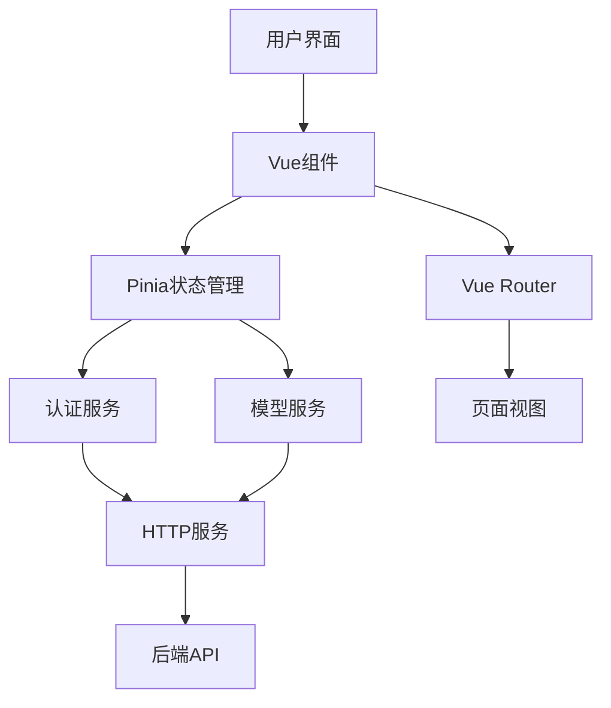
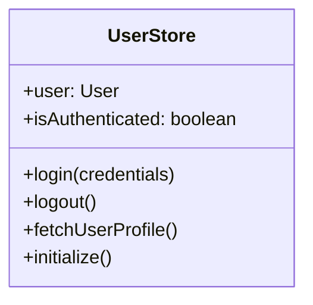

# Vue项目设计文档

## 1. 系统架构



## 2. 核心功能组件

### 2.1 路由配置
- 认证路由：`/login`
- 主页面路由：`/`
- 功能模块：
  - `/comate-prod` - Comate产品页
  - `/user-data` - 用户数据看板
  - `/snake-game` - 贪吃蛇游戏
  - `/flight-status` - 航班状态
  - `/qa` - 问答系统
  - `/policy` - 政策页面

### 2.2 状态管理


### 2.3 服务层
- **AuthService**:
  - 登录/注销
  - JWT令牌管理
  - 用户认证状态检查

- **ModelService**:
  - 获取模型列表
  - 更新模型
  - 删除模型

- **HttpService**:
  - Axios实例配置
  - 请求/响应拦截
  - 错误处理

## 3. 核心流程

### 3.1 登录流程
```mermaid
sequenceDiagram
    participant UI
    component AuthService
    participant UserStore
    participant HttpService
    participant Backend

    UI->>AuthService: 提交登录凭证
    AuthService->>Backend: 验证凭证
    Backend-->>AuthService: 返回JWT
    AuthService->>UserStore: 更新用户状态
    UserStore->>HttpService: 设置认证头
```

### 3.2 数据获取流程
```mermaid
sequenceDiagram
    participant UI
    component ModelService
    participant HttpService
    participant Backend

    UI->>ModelService: 请求模型数据
    ModelService->>HttpService: 发送请求
    HttpService->>Backend: API调用
    Backend-->>HttpService: 返回数据
    HttpService-->>ModelService: 处理响应
    ModelService-->>UI: 更新视图
```

## 4. 组件关系

### 4.1 主应用结构
```
App
├── RouterView
├── Navigation (认证状态相关)
└── HomePage
    ├── Carousel (轮播图)
    └── ContentArea
```

### 4.2 轮播图组件功能
- 自动播放控制
- 触摸/键盘导航
- 响应式设计
- 进度指示器

## 5. 技术栈
- Vue 3 + TypeScript
- Pinia (状态管理)
- Vue Router
- Ant Design Vue (UI组件)
- Axios (HTTP客户端)
- Vite (构建工具)

## 6. 安全考虑
- JWT令牌存储
- 路由守卫
- HTTP拦截器处理401错误
- 敏感操作需要认证