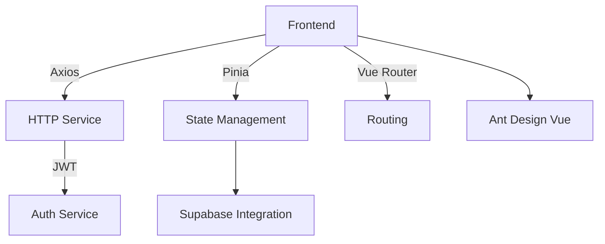

# Turtle Soup -- Detective Game

A Vue.js based interactive detective game with authentication system and admin panel.

## Features

- **Authentication System**: JWT-based login/registration
- **Game Modules**:
  - Turtle Soup detective game
  - Snake game
  - Flight status tracker
  - Q&A system
  - Policy management
- **Admin Panel**: User data management

## Technical Stack



## Development Setup

### Prerequisites
- Node.js 18+
- npm 9+

### Installation
```sh
npm install
```

### Running the Project

Start backend server:
```sh
node server.js
```

Start development server:
```sh
npm run dev
```

Build for production:
```sh
npm run build
```

Run tests:
```sh
npm run test:unit
```

Lint code:
```sh
npm run lint
```

## Project Structure

- `src/views/`: Main game views
- `src/components/games/`: Game components
- `src/services/`: API services
- `src/stores/`: Pinia stores
- `src/config/`: Game configurations

## Running views


## License
MIT License (see LICENSE file)
  
